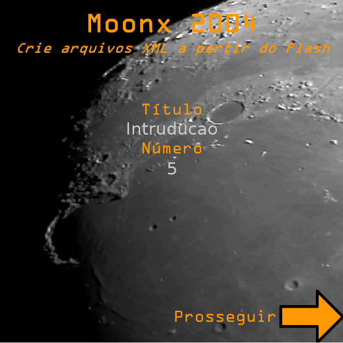

# Moonx 2004 (meu primeioro app)
by Francisco Mat
Made in 2004

Make pre-formated XML from inside Flash to be used in other software

## History from project (translated by Google)
At the age of 16 this was my first completed work that met a client's real requests, until then I was studying Flash MX (and html) and just copied examples of books to learn how to program, I remember it was a Saturday and the 3 project team members were challenged in an afternoon to make a functional software that generated an XML to be used to control classes by a teacher.

Each member created their software to their own liking, the Moon theme with the name Moonx was just a joke, Moon + XML = Moonx. Usability criteria can already be highlighted, such as the ease to test just by clicking on proceed to the end, without having to enter data. In addition to the yellow colors with high contrast, it still has sound and an audio recording with my own voice speaking Moonx at the end when I generated the XML file.

Limitations were also quickly noticed by the team, as the amount of lines that only occupied the screen, with no possibility of scrolling. As curiosity I reported that I was the first to finish the challenge, in a few hours, despite being criticized for the "low" quality of the code by member number 2, this only finished a functional version of its prototype hours later and despite the code " superior, "was less friendly and with unfinished design, I remember he" copied "the idea of ​​using a theme, in my case moon and was quick to leave his app working, when asked why he thought his code so superior. Member number 3 did not get any practical results.

Unfortunately no app generated on that day was actually used, this project was archived for 14 years until I made it available as a curiosity here in github and in my portfolio. Names of clients and staff members were kept confidential because I did not ask permission to divulge, I do not think it is necessary or important to divulge, but the originals dated that year.

* Made in Windows XP + Flash MX.

## História do Projeto

Aos 16 anos de idade esse foi meu primeiro trabalho finalizado que atendia a requisições reais de um cliente, até então eu estava estudando Flash MX (e html) e apenas copiava exemplos de livros para aprender a programar, lembro que foi um sábado e os 3 membros da equipe do projeto de estudos foram desafiado em uma tarde fazer um software funcional que gerasse um XML para ser usado para controle de aulas por um professor.

Cada membro criou seu software ao seu próprio gosto, o tema de Lua com o nome Moonx foi apenas uma brincadeira, Moon + XML = Moonx. Critérios de usabilidade já podem ser destacadas, como a facilidade para testar apenas clicando em prosseguir até o final, sem precisar inserir dados. Além das cores amarelas com alto contraste, ainda conta com som e uma gravação de audio com a minha própria voz falando Moonx ao final quando gerasse o arquivo XML.

Limitações também foram rapidamente notadas pela equipe, como a quantidade de linhas que só ocupavam a tela, sem possibilidade de rolagem. Como curiosidade relato que eu fui o  primeiro a terminar o desafio, em poucas horas, apesar de ser criticado pela "baixa" qualidade do  código pelo membro número 2, este só terminou uma versão funcional do seu protótipo horas depois e, apesar do código "superior", era menos amigável e com design sem acabamento, lembro que ele "copiou" a ideia de usar um tema, no meu caso lua e se apressou em deixar seu app funcionando, quando questionado porque achava seu código tão superior. O membro número 3 não conseguiu nenhum resultado prático.

Infelizmente nenhum app gerado nesse dia foi de fato usado, esse projetinho ficou arquivado por 14 anos até eu disponibilizá-lo como curiosidade aqui no github e no meu portfolio. Nomes de clientes e membros da equipe foram mantidos em confidencialidade pois não pedi autorização para divulgar, não acho que seja necessário e nem importante divulgar, mas sim os originais datados daquele ano.

* Feito em Windows XP + Flash MX.

Francisco Matelli Matulovic - 2004 - 2018